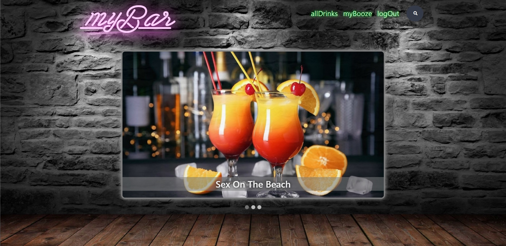
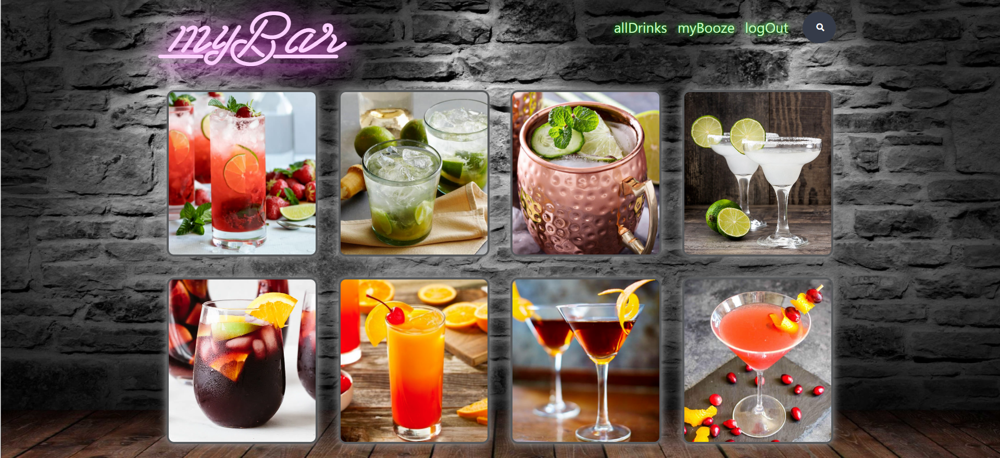
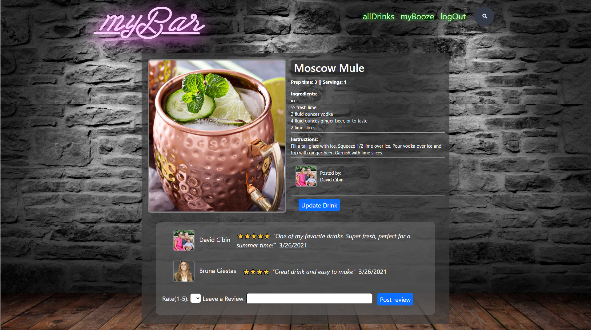
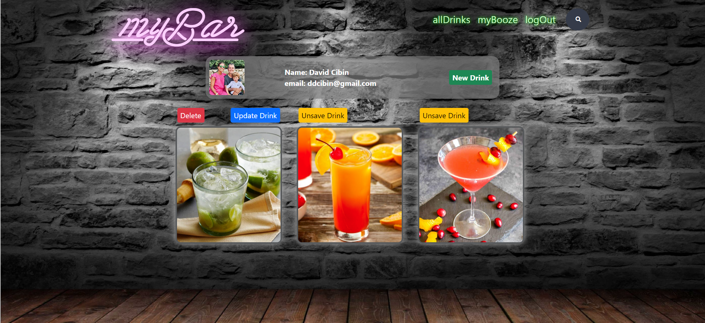
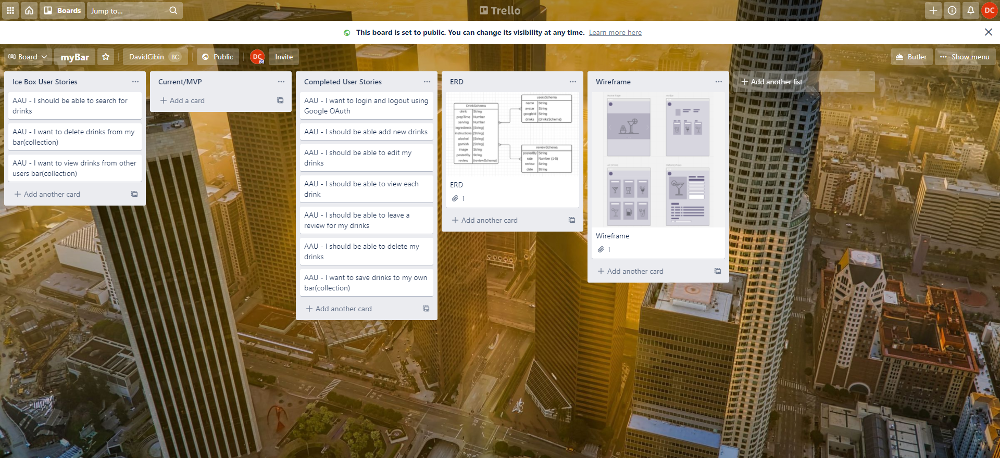
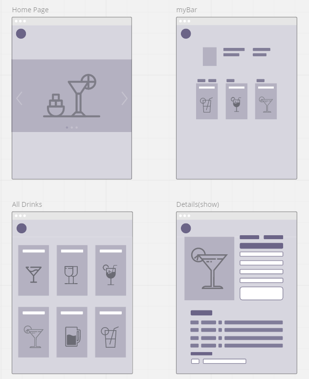

# myBar - Created by David Cibin

### Introduction

This application aims to demonstrate what was taught in unit 2 of the Software Engineering Immersive program offered by [General Assembly](https://www.generalassemb.ly). This project consists in building a full-stack application from the groud up, using full 'MEN' stack application (MongoDB, Express, Node), handling the communication of CRUD actions (Create, Read, Update, Delete) between server and client.

### Getting Started

From my head to the "board", I used [Miro](https://miro.com/app/board/o9J_lNajHwA=/) for my wiriframe

For my planning, I used [Trello](https://trello.com/b/VAZFgOAG/mybar) to keep track of each step  and keep everything organized 

This app was deployed using Heroku and you can access it [here](https://mybooze.herokuapp.com/)

### Screenshots
 
Landing Page

All Drinks

Drink Info

Profile Page

Trello

Wiriframe

### Technology
 
To accomplish this project, here are the list of used tools:
* Visual Studio Code
* JavaScript
* HTML5
* CSS
* Git
* GitHub
* Node
* MongoDB (Atlas)
* Express
* Mongoose
* Dotenv
* Google OAuth
* Bootstrap
* Heroku
* And maaaany hours of Google search.

### Future plans:

I want to use API next to have a wider "menu" of drinks for users to access.
Only some parts of this app are responsive, so I want to make it full responsive.
Add Facebook login option

### Credits:

* Favicon: [favicon.io](https://favicon.io/)
* Background: [Alpha Coders](https://wall.alphacoders.com/)
* Drinks recipes: [Allrecipes](https://www.allrecipes.com/)
* Toolkit: [Bootstrap](https://getbootstrap.com/)
* Fonts: [Google fonts](https://fonts.google.com/) & [Neon font used for logo](https://www.mansgreback.com/)
